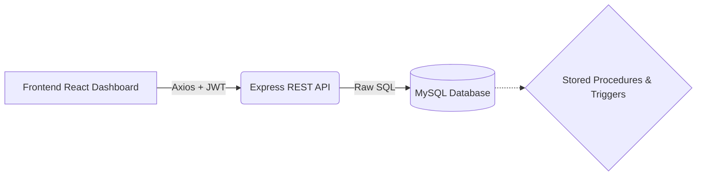

# Unified Recruitment & Payroll Management System (URPMS)


URPMS is a full-stack, internal operations platform designed to seamlessly manage candidate intake, recruitment pipeline progression, interview evaluation, employee onboarding, and payroll generation.

Built with a **database-centric architecture**, URPMS leverages raw SQL with MySQL to enforce critical business workflow logic directly at the database level using stored procedures and triggers. This ensures data integrity and operational consistency, paired with a modern, responsive React dashboard for recruiters and HR personnel.

## ✨ Features

- **Candidate Management**: Track candidates from profile creation through the hiring pipeline.
- **Advanced Recruitment Pipeline**: Enforce a consistent hiring pipeline with valid state transitions (Applied → Shortlisted → Interview Scheduled → Interviewed → Offered → Hired/Rejected).
- **Interview & Evaluation**: Schedule interviews and capture structured technical, communication, and overall feedback.
- **Automated Employee Onboarding**: Convert hired candidates into employees automatically using secure database stored procedures.
- **Payroll Generation**: Generate payroll records and track payment completion status effortlessly.
- **Analytics Dashboard**: Gain operational visibility through dynamic metrics, KPI cards, and interactive Recharts data visualizations.
- **Role-Based Authentication**: Secure JWT-based authentication system with Admin controls.
- **Modern UI/UX**: Fully responsive, card-based layout featuring a beautifully crafted Dark Mode.

## 🏗️ Technology Stack

### Frontend
- **Framework**: React (Bootstrapped with Vite)
- **Styling**: TailwindCSS & Framer Motion
- **Data Visualization**: Recharts
- **State Management & Routing**: React Router, Axios (for API communication)

### Backend
- **Runtime**: Node.js
- **Framework**: Express.js
- **Authentication**: JWT (JSON Web Tokens)
- **Security**: CORS, Basic security headers, Login rate limiting

### Database
- **Engine**: MySQL
- **Integration**: Raw SQL via `mysql2` driver
- **Logic**: Extensive use of Stored Procedures, Functions, and Triggers for business rules enforcement.

## ⚙️ High-Level Architecture



## 🚀 Getting Started

### Prerequisites
- Node.js (v16+)
- MySQL Server (v8.0+)
- npm or yarn

### 1. Database Setup
1. Create a MySQL database named `urpms`.
2. Import the database schema and procedures from the `/database` directory to set up the necessary tables, triggers, and stored procedures.

### 2. Backend Setup
1. Navigate to the backend directory:
   ```bash
   cd backend
   ```
2. Install dependencies:
   ```bash
   npm install
   ```
3. Create a `.env` file in the backend root and configure your environment variables:
   ```env
   PORT=5000
   DB_HOST=localhost
   DB_USER=root
   DB_PASSWORD=your_password
   DB_NAME=urpms
   JWT_SECRET=your_jwt_secret_key
   ```
4. Start the backend server:
   ```bash
   npm run dev
   ```

### 3. Frontend Setup
1. Navigate to the frontend directory:
   ```bash
   cd frontend
   ```
2. Install dependencies:
   ```bash
   npm install
   ```
3. Create a `.env` file in the frontend root and set the API base URL:
   ```env
   VITE_API_BASE_URL=http://localhost:5000/api
   ```
4. Start the frontend development server:
   ```bash
   npm run dev
   ```

## 🔐 Security & Validation

- **Protected Routes**: All business routes are protected by JWT authentication.
- **Input Validation**: Robust validation for emails, numeric fields, CGPA ranges, and interview scores.
- **Database Enforcement**: Business rules (e.g., feedback cannot be inserted before an interview is completed) are enforced directly via MySQL triggers.

## 📈 Future Enhancements

- Role-specific dashboards (Recruiter, Finance, Auditor).
- Automated email notifications and calendar integration for interviews.
- Exportable reporting and rich payroll breakdowns.
- Resume uploads and document parsing.

---
*Built for modern HR operations. Database-centric by design.*
